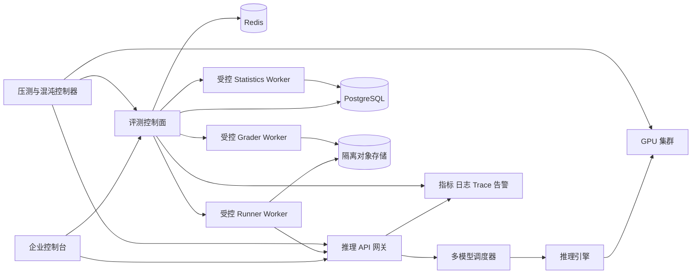
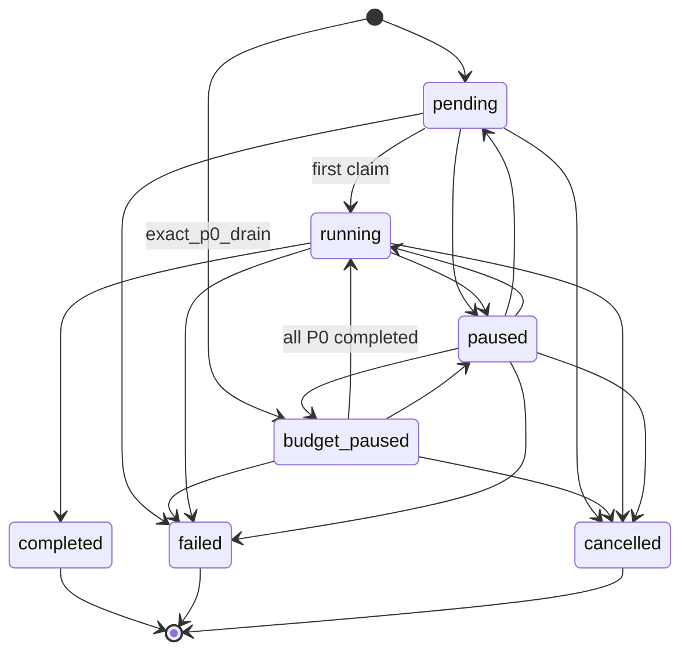
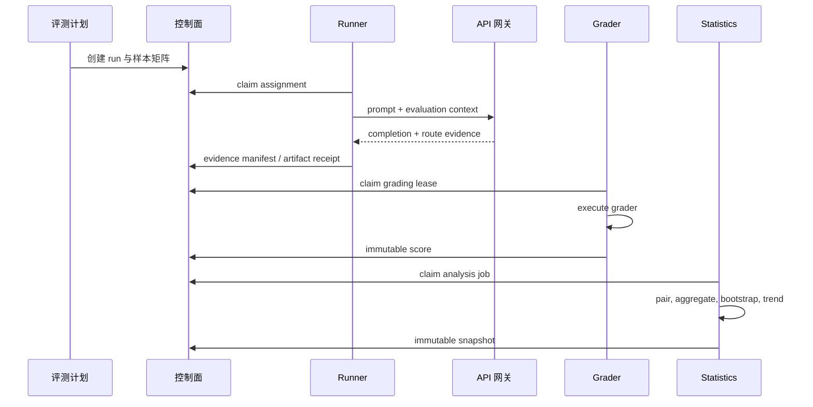
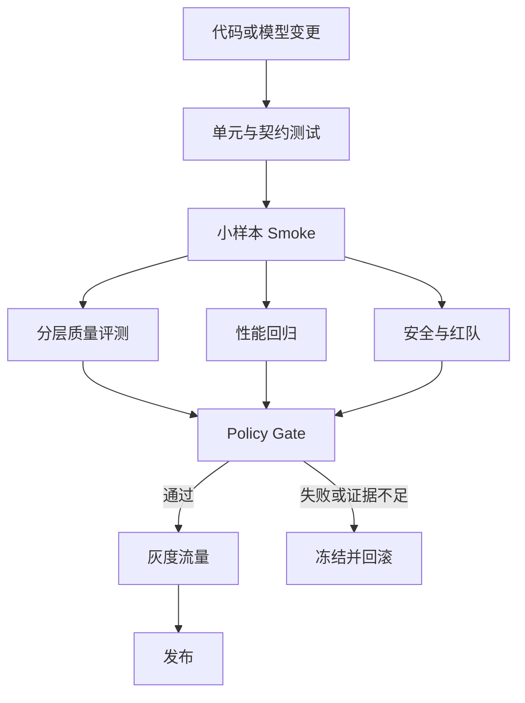

# 大模型平台测试架构与方法论

## 1. 文档定位

本文是 Sub2API Model Quality Radar 的总设计，覆盖推理网关、精调训练、自动化评测、企业控制台、Worker 控制面和生产运维。它定义测试对象、证据链、统计判定、发布门禁和故障演练方式。

已有的配置细节见 [model-quality-radar-configuration.md](model-quality-radar-configuration.md)，生产部署与恢复步骤见 [radar-production-runbook.md](radar-production-runbook.md)。可信执行核心的可执行合同见 [Radar 可信执行核心 G1 合同设计](superpowers/specs/2026-07-27-radar-trusted-execution-contracts-design.md)，本总设计与该补丁冲突时以补丁为准。

目标有四个：

1. 发现模型能力退化、协议退化、安全退化和成本退化。
2. 发现网关、调度、推理引擎和 GPU 集群的性能及可靠性回归。
3. 让每个结论都能追溯到数据集版本、模型版本、路由版本、配置摘要和原始证据摘要。
4. 为企业客户提供可解释、可审批、可回滚的质量门禁。

## 2. 设计边界

Radar 负责受控评测流量和评测证据。客户生产流量继续经过正常的 API 网关、计费和限流链路。评测身份使用独立用户、独立 API Key、独立分组和独立预算，拥有单独的并发与 RPM 上限。

质量结论与可靠性结论分别计算。一个模型即使能力得分通过，也可能因为 P99 延迟、错误率、成本或安全事件而被阻止发布。一个版本即使性能通过，也可能因为能力退化而被阻止发布。

## 3. 总体架构



### 3.1 组件职责

| 组件 | 责任 | 关键测试面 |
| --- | --- | --- |
| API 网关 | 鉴权、限流、计费、协议兼容、路由证据 | 正确性、隔离、P99、错误分类 |
| 调度器 | 模型与渠道选择、故障转移、负载均衡 | 路由稳定性、热 key、降级路径 |
| 推理引擎 | batching、KV cache、流式输出、GPU 执行 | TTFT、TPOT、吞吐、显存和 OOM |
| 控制面 | 数据集、运行、预算、租约、治理、门禁 | 状态机、幂等、鉴权、灾备 |
| Runner | 领取样本、调用网关、提交证据 | 重试、租约、证据完整性 |
| Grader | 读取受控证据、执行评分器、提交得分 | 评分器一致性、越权防护 |
| Statistics | 配对、聚合、置信区间、趋势检测 | 统计有效性、重复计算、窗口迟到 |
| 控制台 | 运行编排、差异查看、审批、告警处理 | RBAC、可解释性、审计、响应式 |

## 4. 核心领域模型

所有可发布的评测结果都必须包含以下身份元组：

```text
dataset_version
run_id
case_id
sample_index
model_route
model_version
model_config_sha256
route_profile_version
gateway_route_trace_id
grader_id + grader_version
analysis_version
```

### 4.1 不可变对象

数据集版本、已发布 Case、评测运行的候选与基线引用、原始证据摘要、评分记录和聚合快照都采用追加式写入。修正通过新版本或 regrade 产生新记录，保留旧记录和原因。已完成的运行不能重新打开。

### 4.2 状态机



单个样本的执行状态为 `pending`、`leased`、`running`、`evidence_uploaded`、`grading`、`completed`。基础设施失败、上游失败、证据无效、评分失败和取消都必须保留明确的 failure class 与 failure code。

## 5. 模型质量方法论

### 5.1 评分器分层

| 层级 | 适用场景 | 判定方式 |
| --- | --- | --- |
| L0 确定性 | JSON Schema、HTTP 状态、工具名、字段和安全协议 | 规范化后精确比较 |
| L1 可执行 | 代码、SQL、数学、函数调用 | 编译、单测、沙箱执行和约束检查 |
| L2 语义 | 长文本、解释、摘要、开放式推理 | 结构化 rubric、规则评分和受控 Judge |
| L3 安全 | 越狱、提示注入、数据外泄、危险建议 | 红队攻击集、策略分类和人工复核 |
| L4 运营 | 延迟、错误率、成本、限流和路由 | 指标窗口、分位数和 SLO 门限 |

单个输出允许具有多样性。对开放式输出不使用全文字符串断言，评分器应提取结构化事实、约束满足度、可执行结果和安全属性。确定性协议仍然使用严格断言，因为协议漂移会直接破坏下游系统。

### 5.2 公共基准适配

MMLU、GSM8K、HumanEval、MBPP、BBH、IFEval、LongBench 和安全红队数据集都通过统一 Case Adapter 接入。Adapter 负责：

1. 将外部数据集固定为内部 manifest 和 SHA256。
2. 映射能力域、优先级、权重、语言和保密级别。
3. 将输入转换为平台路由可接受的协议。
4. 输出统一的 score、passed、failure class 和 evidence hashes。
5. 记录数据集许可、来源和不可公开字段的加密引用。

公共基准用于横向比较，内部合成集和生产回放集用于发现平台特有回归。两类结果分开展示，不能用公共基准平均分掩盖生产协议问题。

## 6. 如何检测模型“降智”

### 6.1 先定义退化维度

“降智”需要拆分为多个可观测维度：

| 维度 | 例子 | 核心指标 |
| --- | --- | --- |
| 能力 | 数学、推理、代码、指令遵循 | 加权通过率、执行成功率 |
| 稳定性 | 同一输入多次运行 | 通过率方差、失败簇比例 |
| 协议 | JSON、工具调用、流式事件 | schema 通过率、事件序列错误率 |
| 安全 | 越狱、外泄、危险行动 | attack success rate、违规严重度 |
| 效率 | 延迟、吞吐、token 消耗 | TTFT、TPOT、P99、单位成本 |
| 路由 | 真实别名是否命中目标版本 | route identity、渠道漂移率 |

只有能力分数下降时，报告为能力退化。若协议或安全下降，直接提升严重级别，避免将安全问题稀释到总平均分。

### 6.2 配对实验

候选版本与基线版本必须使用同一 `case_id`、同一 `sample_index`、同一数据集版本、同一路由配置摘要和同一执行策略。每个 Case 可以重复采样多次，管理 API 的单次 `sample_count` 范围为 1 到 10。重复数由优先级和噪声估计决定：

```text
P0: 单 Case 10 次，关键能力域至少 30 个有效 pair
P1: 5 到 10 次
P2: 1 到 3 次
```

P0 的 30 个有效 pair 可以来自同一能力域的多个独立 Case。跨 run 合并只有在 dataset manifest、model config hash、route profile、grader、analysis version 和时间分块策略完全一致，且统计实现显式保存跨 run 聚合身份时才允许；当前 staging 验收在单个 run 内完成 30 对。

在固定随机种子可用时保存种子。上游不支持确定性时保存采样参数、系统提示词摘要、工具版本和上下文长度。候选和基线的请求顺序要交错，避免时间段、GPU 温度和上游负载形成混杂变量。

### 6.3 统计量

对每个能力域计算配对差值：

```text
d_i = score_candidate_i - score_baseline_i
Delta = sum(weight_i * d_i) / sum(weight_i)
```

使用固定种子的 bootstrap 产生 95% 置信区间。样本量较小、分布明显偏斜或存在大量离散失败时，同时报告中位数差、胜平负比例和 McNemar 或置换检验结果。任何单一 p 值都不能单独决定发布。

### 6.4 退化判定

Gate Decision 使用五个持久化状态：`insufficient_evidence`、`recorded`、`blocked`、`review_required` 和 `passed`。`waived` 是由有效 Waiver 产生的查询投影。一次评估只能命中一个持久化状态，按下列优先级从上到下短路：

| 优先级 | 条件 | 状态 | 发布效果 |
| --- | --- | --- | --- |
| 1 | 样本、评分、聚合或路由证据缺失 | `insufficient_evidence` | 阻止自动发布，补齐证据后创建新决策 |
| 2 | 新 P0 协议或安全失败 | `blocked` | 立即冻结发布和扩流 |
| 3 | 实际路由与冻结路由身份不匹配 | `blocked` | 立即冻结发布并创建路由事件 |
| 4 | 可靠性 SLO 已越界 | `blocked` | 立即冻结发布，质量得分不能抵消 |
| 5 | 尚未完成 14 个完整观察日 | `recorded` | 仅记录统计质量结论，不执行质量阈值 |
| 6 | 能力域或总体 Delta 达到阻断阈值，且策略要求的置信条件成立 | `blocked` | 阻止发布 |
| 7 | Judge 分歧、点估计下降但证据未达到阻断条件，或趋势检测触发 | `review_required` | 进入人工复核或追加样本 |
| 8 | 以上条件均未命中 | `passed` | 允许进入下一发布阶段 |

`waived` 投影只能由一个已有的 `blocked` 或 `review_required` 决策经独立豁免流程产生。豁免保存业务理由、风险负责人、缓解措施、复测计划和过期时间，不覆盖原始决策。

14 天 record-only 仅适用于统计质量阈值。P0 协议与安全失败、路由错配、可靠性 SLO 越界和证据缺失在观察期内仍按上表处置。观察期结束需要 `quality_admin` 与 `release_manager` 两个不同主体确认样本覆盖、误报复盘、告警路由和回滚演练证据，随后创建新版本 Gate Policy 并进入 enforcement。

质量阈值必须按能力域配置。若 `RequireCIExcludeZero=true`，阻断条件同时要求 `Delta <= approved_degradation_threshold` 和 95% 置信区间上界小于零。其余负向点估计进入 `review_required`。延迟采用相对百分比阈值，安全采用攻击成功率上升阈值。阈值、统计策略、审批人、有效期和豁免理由都写入不可变 Gate Policy 版本，不能写死在前端或由评估请求提交。

### 6.5 趋势检测

单次运行用于发布门禁，连续窗口用于线上雷达：

1. EWMA 发现缓慢漂移。
2. CUSUM 发现小幅持续下降。
3. Bootstrap 区间避免把随机噪声当成退化。
4. 以模型版本、路由、区域、租户类型和能力域分层，避免 Simpson 悖论。
5. 连续两个窗口触发 Yellow 时自动扩大样本，连续三个窗口触发 Red 时创建事件并冻结自动发布。

### 6.6 误报与混杂因素处理

以下条件发生时，结果标记为 `insufficient_evidence`，重新运行后才能决定质量：

- 路由配置摘要、系统提示词、工具 schema 或 tokenizer 发生变化。
- 上游错误、限流、超时和 GPU OOM 超过预设比例。
- 候选与基线的样本配对不完整。
- Judge 版本变化且未完成校准集。
- 置信区间过宽，统计功效不足。

基线或候选命中与冻结配置不一致的模型、渠道或 route profile 时，状态为 `blocked`，规则为 `route.identity`。路由证据完全缺失时使用 `insufficient_evidence`。这两类运行都不能展示为通过。

## 7. 推理自动化回归框架

### 7.1 标准流水线



### 7.2 Diff 报告

报告至少包含：

- 运行身份、时间窗口、数据集 manifest 和模型引用。
- 总体分数与每个能力域分数。
- 候选相对基线的 Delta、95% 区间、样本量和统计功效。
- 胜平负样本、失败分类和 Top regression Cases。
- 输出结构差异、工具调用差异、流式事件差异和截断差异。
- TTFT、TPOT、端到端延迟、P50/P95/P99、错误率、重试率和单位成本。
- 路由 trace 摘要、配置摘要和不可公开证据引用。
- 门禁结果、触发规则、豁免、审批人和有效期。

原始 prompt、完整 completion、隐藏推理、API Key、账号 ID、渠道 ID 和任意上游错误原文不能出现在报告或告警中。需要调查时使用受控 artifact 和权限审计。

## 8. 精调训练端到端测试

### 8.1 阶段

| 阶段 | 测试重点 | 放行证据 |
| --- | --- | --- |
| 数据上传 | 格式、编码、字段、PII、重复和毒化样本 | manifest、扫描报告、数据质量报告 |
| 数据切分 | train/validation/test 隔离、去重和泄漏 | split hash、泄漏率、样本计数 |
| 训练调度 | GPU 资源、队列、公平性、抢占恢复 | 任务状态机、资源账本、恢复记录 |
| SFT | loss、eval loss、梯度、吞吐、checkpoint | 指标曲线、checkpoint hash |
| RLHF/DPO | reward、KL、拒答率、偏好一致性 | reward 曲线、对齐评测 |
| 模型产出 | 权重、tokenizer、配置、量化和签名 | artifact manifest、SBOM、签名 |
| 上线前 | Radar 质量与性能门禁 | Gate Decision、审批审计 |

训练任务每次重试都使用新的 attempt，保留原始日志和资源消耗。任务完成与模型发布分离，训练成功不代表模型具备发布资格。

### 8.2 训练特有回归

- 数据分布变化：label、语言、长度、难度和安全标签漂移。
- 训练退化：loss 下降但能力下降、过拟合、灾难性遗忘。
- 对齐退化：拒答边界漂移、越狱成功率上升、工具权限扩大。
- 产物退化：tokenizer 不匹配、权重缺片、配置与运行时不一致。
- 资源退化：同一 batch 的显存、吞吐、checkpoint 时间和恢复时间超标。

## 9. 推理性能回归

### 9.1 指标定义

| 指标 | 定义 | 采集点 |
| --- | --- | --- |
| TTFT | 请求到首个有效 token 的时间 | 网关与引擎 |
| TPOT | 相邻输出 token 的平均间隔 | 引擎 |
| E2E | 请求到完成事件的时间 | 网关 |
| P99 | 窗口内 99 分位延迟 | 网关、路由、引擎分别计算 |
| Goodput | 满足质量和 SLA 的有效请求数 | 网关 |
| GPU 利用率 | SM、显存带宽、显存占用 | GPU exporter |
| 单位成本 | 每百万输入/输出 token 成本 | 计费与模型定价 |

P99 必须按模型、区域、流式模式、输入长度、输出长度、租户等级和并发档位分层。全局平均值不能替代分层 P99。

### 9.2 性能基线

压测前执行 warmup，丢弃启动和缓存预热阶段。测试矩阵至少包括并发 1、10、50、100、峰值和峰值两倍，输入长度 128、2K、8K、32K，输出长度 64、512、2K。每个格点需要达到最小有效请求数，或持续固定时间，并记录负载发生器丢包。

建议的性能门禁：

```text
P99 latency <= baseline_p99 * (1 + allowed_regression_ratio)
TTFT P99 <= route-specific SLO
error_rate <= baseline_error_rate + allowed_error_delta
throughput >= baseline_throughput * minimum_retention_ratio
cost_per_success <= approved_cost_limit
```

若质量分数下降但延迟改善，两个结果同时展示，由 Gate Policy 决定是否允许发布。

## 10. 大规模并发、故障演练与混沌

### 10.1 多租户压测

负载模型模拟真实租户分布：小租户长尾、头部租户突发、不同 API Key、不同模型、流式和非流式混合。每个请求带有租户、模型、区域和 trace 标签。压测账户使用隔离预算，绝不借用客户配额。

必须观察：限流准确率、队列等待、调度公平性、热 key、渠道熔断、重试放大、计费幂等、数据库连接池、Redis 延迟和 GPU 分配。

### 10.2 混沌场景

| 场景 | 注入方式 | 通过条件 |
| --- | --- | --- |
| Redis 不可用 | 断网或延迟 | 鉴权与限流按策略 fail-close，恢复后无数据污染 |
| PostgreSQL 主库切换 | kill、只读、延迟 | 新请求按 RTO 恢复，已完成分数不重复 |
| Worker 崩溃 | kill、暂停、网络隔离 | lease 过期可回收，证据不重复提交 |
| 上游 429/5xx | mock 或代理注入 | 重试有界，错误分类准确，计费一次 |
| GPU OOM | 限制显存或提高上下文 | 路由降级可控，客户错误可解释 |
| 网络分区 | 控制面与 Worker 分区 | 租约过期，恢复后重新注册 |
| 时钟偏移 | NTP 偏移 | token TTL 与 lease fencing 拒绝异常时钟 |
| 对象存储不可用 | HEAD/上传失败 | artifact 标记无效，不产生能力回归 |

每次演练记录假设、注入范围、观测指标、用户影响、恢复时间和未解决项。演练结束后由值班负责人关闭事件，不能只看服务是否重新启动。

### 10.3 混沌演练护栏

混沌默认只在隔离环境运行。生产演练必须具备已批准的变更单、值班负责人、安全负责人、回滚执行人和实时通信频道，并遵守以下约束：

1. 单次只注入一种故障，影响范围限制为一个评测租户、一个 Worker 或不超过 5% 的评测容量。
2. 客户生产 API Key、客户预算、客户队列和未脱敏数据不得进入注入范围。
3. 业务高峰、发布冻结期、备份异常期和已有 P0/P1 事件期间禁止启动。
4. 任一客户错误率上升 0.5 个百分点、客户 P99 上升 20%、控制面可用性低于 99.9%、数据哈希不一致或告警链路失效时自动停止。
5. 停止后先撤销故障，再隔离异常 Worker，验证 lease fencing、账本幂等、score 不可变和对象引用一致，最后恢复流量。
6. 演练证据包含审批单、开始与停止时间、影响对象、指标快照、trace ID、数据完整性查询、回滚结果和复盘负责人。

首次生产演练只允许进程终止和单 Worker 网络隔离。数据库切换、对象存储故障、时钟偏移和区域切换需要先在同构预生产环境取得两次成功证据。

## 11. 容灾与数据恢复

| 数据 | RPO | RTO | 恢复要求 |
| --- | --- | --- | --- |
| 评测控制面元数据 | 5 分钟 | 30 分钟 | PITR、迁移校验、幂等恢复 |
| immutable score 和 aggregate | 5 分钟 | 30 分钟 | 分区恢复、哈希校验、禁止覆盖 |
| 证据 manifest | 5 分钟 | 30 分钟 | 数据库与对象存储引用一致 |
| 临时 artifact | 24 小时 | 4 小时 | 可丢弃，不能影响已确认评分 |
| 配置与 Gate Policy | 5 分钟 | 30 分钟 | 版本化备份、审批记录完整 |

容灾切换必须验证：控制面可写、Worker 可重新注册、未完成 lease 可回收、已完成 score 不重复、告警目标仍可达、网关路由 profile 与区域一致。恢复演练在隔离环境执行，不能直接重放所有完成任务。

## 12. 可观测性、SLA 与告警

### 12.1 Trace 贯穿字段

```text
request_id
route_trace_id
evaluation_run_id
sample_id
assignment_id
lease_id
model_route
model_version
region
worker_id
```

敏感字段只保留 HMAC reference。日志采用结构化事件，错误分类使用有限枚举，禁止把上游任意正文直接写入日志。

### 12.2 初始 SLO

| SLO | 目标 | 告警窗口 |
| --- | --- | --- |
| 控制面可用性 | 99.9% | 15 分钟 |
| Worker claim P99 | 小于 500 ms | 10 分钟 |
| lease expiry rate | 小于 1% | 15 分钟 |
| evidence rejection | 小于 2% | 15 分钟 |
| grading completion age | 小于 15 分钟 | 10 分钟 |
| analysis completion age | 小于 15 分钟 | 10 分钟 |
| 推理 P99 | 按模型路由策略 | 10 分钟 |
| upstream error rate | 按渠道基线 | 10 分钟 |
| 质量 Delta | 不低于 Gate Policy | 每次运行 |

质量告警、可靠性告警、成本告警和安全告警分开路由。一个维度恢复不能自动关闭其他维度事件。告警必须链接到运行、样本、门禁决策和审计记录。

### 12.3 SLI 计算合同

所有窗口使用 UTC 半开区间 `[start, end)`。服务指标允许 2 分钟迟到，质量聚合允许 30 分钟迟到；窗口封存后到达的数据写入校正快照，不能覆盖原快照。每个快照保存查询版本、数据源水位、分子、分母、样本量和计算哈希。

| SLI | 分子 | 分母 | 数据源与排除规则 |
| --- | --- | --- | --- |
| 控制面可用性 | 在服务端截止时间内返回非 5xx 的合格请求 | 到达控制面的全部合格请求 | OpenTelemetry 服务端 span；排除健康探针、鉴权前被客户端取消的请求和明确的压测流量 |
| Worker claim P99 | claim 请求服务端耗时的 99 分位 | 成功返回 lease 或 no-work 的 claim 请求 | 控制面 span；认证失败单独计入安全指标，不进入延迟分布 |
| lease expiry rate | 未完成且到期被回收的 lease | 已成功发放的 lease | lease 事件表；操作员在截止前主动取消的 run 单独记录 |
| evidence rejection | 因签名、哈希、大小、类型、扫描或身份不符被拒绝的提交 | 全部 evidence confirm 请求 | evidence 事件；幂等重放命中不计为拒绝 |
| grading completion age | 在目标时间内进入终态的 grading job | 进入队列的 grading job | grading job 事件；取消 run 的 job 单独分层 |
| analysis completion age | 在目标时间内进入终态的 analysis job | 进入队列的 analysis job | analysis job 事件；迟到 pair 触发的新版本快照独立计数 |
| 推理 P99 | 成功推理的 E2E 延迟 99 分位 | 对应模型、区域、协议、长度和并发切片的成功请求 | 网关 span 与 route evidence；超时和 5xx 进入错误率，客户端取消独立展示 |
| upstream error rate | 上游 429、5xx、超时、连接错误和协议错误 | 已发起上游调用 | route attempt 事件；重试的每次 attempt 与最终用户结果分别计数 |
| 质量 Delta | 有效配对的加权候选减基线得分 | 有效配对权重之和 | immutable score head 与 aggregate snapshot；缺失 pair 不进入得分并降低证据充分性 |

延迟分位数每个切片至少需要 200 个有效请求，质量门禁至少需要 30 个有效 pair。样本不足时状态为 `insufficient_evidence`。分位数使用固定桶的 OpenTelemetry histogram 或保留可复算的等价 sketch，桶边界和聚合版本写入快照。

可用性错误预算按滚动 30 天计算。页面告警采用双窗口燃尽：5 分钟和 1 小时同时超过 14.4 倍时触发快速告警；30 分钟和 6 小时同时超过 6 倍时触发慢速告警。质量、安全与路由身份使用事件门禁，不通过可用性错误预算抵扣。

平台值班负责控制面、Worker 和存储 SLO，推理值班负责网关、调度和上游可靠性，质量负责人负责数据集、评分器和统计结论，安全负责人负责 P0 安全事件。每次发布复核指标查询版本，每季度执行一次从原始事件到告警的复算演练。

## 13. 企业控制台设计

### 13.1 页面与角色

| 页面 | 主要角色 | 核心动作 |
| --- | --- | --- |
| Radar 总览 | viewer | 查看质量、SLO、活跃告警 |
| 数据集 | quality_admin | 导入、校验、发布、退休 |
| 评测计划 | quality_admin、test_operator | quality_admin 创建版本化计划，test_operator 启动和重试运行 |
| 运行详情 | test_operator | 启停、重试、查看差异和证据 |
| 基线 | quality_admin、release_manager | 提议、质量审批、发布审批 |
| Gate Policy | quality_admin | 编辑阈值、样本量和豁免条件 |
| Worker | test_operator、platform_admin | 注册、禁用、能力和心跳 |
| 告警 | viewer、release_manager | 确认、归因、恢复、关闭 |
| 审计 | platform_admin | 查看审批、配置和权限变更 |

页面采用表格、分层指标和时间窗口，先展示结论再提供证据钻取。所有危险动作需要二次确认、原因和审计事件。原始秘密字段永远不进入前端状态。

### 13.2 RBAC

最小角色集合为 `viewer`、`test_operator`、`quality_admin`、`release_manager`、`platform_admin`。发布门禁决策与质量基线审批分离，豁免操作必须拥有独立权限、过期时间和关联事件。

## 14. CI/CD 与发布门禁



流水线使用四种结果：`pass`、`fail`、`inconclusive`、`waived`。`inconclusive` 只能进入人工复核或追加样本，不能自动转成 `pass`。`waived` 必须带审批人、理由、风险期限和回滚条件。

## 15. 分阶段落地

### Phase 0：可信执行基础

- 完成迁移、Worker 注册、租约 fencing、token rotation 和数据备份。
- 只运行 public 与 synthetic 数据集。
- 记录所有 route trace、证据摘要和预算流水。

### Phase 1：质量回归

- 接入确定性协议、代码执行、数学和指令遵循。
- 建立候选与基线配对、bootstrap 区间和人工复核队列。
- 开启统计质量 record-only；P0、路由身份、可靠性 SLO 和证据充分性继续执行阻断。

### Phase 2：性能与安全

- 接入并发矩阵、长上下文、流式性能和成本回归。
- 接入红队、越狱、提示注入和工具权限测试。
- 为 P0 安全和协议失败启用强门禁。

### Phase 3：治理与企业化

- 启用 RBAC、基线双审批、Gate Policy、告警归因和豁免过期。
- 启用多租户控制台、审计、导出和变更通知。
- 建立值班、SLO 和错误预算。

### Phase 4：规模与灾备

- 扩展到千卡训练和多区域推理调度。
- 执行 Redis、PostgreSQL、GPU、对象存储、区域切换和 Worker 分区演练。
- 用历史事件回放验证降智检测的召回率和误报率。

## 16. 验收矩阵

| 能力 | 最小验收证据 |
| --- | --- |
| 推理回归 | 一个 run 生成完整 diff、Delta、区间和 failure breakdown |
| 降智检测 | 人工注入能力下降时 Gate 进入 Red，随机噪声进入 Yellow 或 inconclusive |
| 路由正确性 | route trace 与 model config hash 可追溯且错配被拒绝 |
| 精调链路 | 上传到模型产出的每阶段状态、artifact hash 和失败恢复记录 |
| 压测 | 多租户矩阵、P99、错误率、限流和计费幂等报告 |
| 安全 | 红队用例、严重度、人工复核和阻断证据 |
| 混沌 | 每个故障场景有注入、恢复、用户影响和未解决项 |
| 容灾 | RPO/RTO 实测、数据 hash、lease 回收和重复提交证明 |
| 控制台 | RBAC、审批、豁免、告警生命周期和审计可复现 |
| 生产值班 | SLO、告警路由、Runbook 和回滚演练记录 |

## 17. 风险与决策记录

1. 开放式生成没有唯一正确字符串，必须保存评分器版本和统计不确定性。
2. Judge 本身会漂移，Judge 升级需要校准集和双跑周期。
3. 基线错误会把系统性退化隐藏起来，基线需要定期重验证和多版本保留。
4. 线上路由变化会伪装成模型能力变化，route identity 是硬门禁字段。
5. 质量和性能常常存在交换关系，Gate Policy 必须显式表达业务取舍。
6. 证据越丰富，隐私和泄漏面越大，默认保存 hash、摘要和受控 artifact 引用。

## 18. 代码与运行入口

- 控制面配置：[model-quality-radar-configuration.md](model-quality-radar-configuration.md)
- 生产 Runbook：[radar-production-runbook.md](radar-production-runbook.md)
- 控制面路由：[../backend/internal/server/router.go](../backend/internal/server/router.go)
- Worker 路由：[../backend/internal/server/routes/radar_worker.go](../backend/internal/server/routes/radar_worker.go)
- Worker 客户端：[../radar-worker/src/sub2api_radar/control_plane.py](../radar-worker/src/sub2api_radar/control_plane.py)
- 统计实现：[../radar-worker/src/sub2api_radar/statistics](../radar-worker/src/sub2api_radar/statistics)
- staging 编排：[../deploy/docker-compose.radar-staging.yml](../deploy/docker-compose.radar-staging.yml)

## 19. Sub2API 平台覆盖边界

### 19.1 推理网关

网关测试按请求生命周期拆分：鉴权、路由解析、限流、并发槽、上游调用、流式转发、用量记录和计费结算。每一层都产生自己的 trace span，故障分类必须区分客户端输入、网关策略、调度、渠道、模型和基础设施。

多模型路由包含豆包、DeepSeek、Qwen 以及其他 OpenAI 兼容上游。每个模型别名绑定候选渠道、优先级、熔断状态、计费规则和能力声明。回归测试固定模型别名与 route profile，防止渠道切换伪装成模型质量变化。

限流与计费测试使用虚拟租户和固定账本：重复请求、超时重试、流式中断、上游 429、网关 5xx、客户端取消和故障恢复都必须验证一次且仅一次的用量结算。限流拒绝不产生模型用量，已收到的 token 按账本规则结算。

### 19.2 精调训练平台

训练平台采用任务编排器、GPU 资源队列、数据服务、训练 Worker、模型仓库和 Radar 验收任务的分层结构。SFT、DPO、RLHF 共享任务状态机与产物 manifest，训练算法通过插件注册。每个产物记录父模型、数据 manifest、代码版本、超参数摘要、硬件拓扑、随机种子、checkpoint 和签名。

训练任务的最低端到端用例：

1. 上传一份带恶意样本、重复样本和格式错误的受控数据。
2. 完成扫描、切分、泄漏检查和人工批准。
3. 启动一个小规模 SFT 任务，注入一次 Worker 中断并恢复 checkpoint。
4. 执行模型产物签名、加载、tokenizer 校验和推理 Smoke。
5. 自动创建 Radar run，比较基线模型与候选模型。
6. 只有质量、性能、安全和成本门禁都达到策略要求，模型才进入可发布状态。

### 19.3 Agent、插件与 Coding Plan

Agent 测试关注工具选择、参数约束、循环终止、权限边界、并行调用、上下文压缩和人工接管。插件生态测试关注 manifest 签名、版本兼容、沙箱网络、文件系统、超时和卸载回滚。Coding Plan 测试关注代码执行隔离、仓库访问授权、补丁可复现、资源预算和敏感信息脱敏。

Agent 评测输出需要保存工具调用序列、参数 schema 摘要、观察结果摘要、最终动作和资源消耗。工具调用的顺序与参数合法性使用确定性评分器，任务完成质量使用可执行测试和受控 Judge。任何越权工具调用都属于 P0 安全失败，不会被总分抵消。

### 19.4 企业控制台与开放接口

控制台的 API 契约、路由契约和权限契约共享同一组测试夹具。每个危险动作至少验证：无权限拒绝、错误主体拒绝、重复提交幂等、成功审计、刷新后状态一致和撤销后不可继续操作。前端只消费脱敏 DTO，详情钻取通过短时效、带权限的后端接口完成。

开放接口采用契约测试生成器覆盖 OpenAI、Anthropic、Gemini 兼容格式、流式 SSE、工具调用、图像输入和错误格式。模型差异放入 Adapter，公共协议行为保持稳定。版本升级必须同时运行旧客户端兼容集和新功能集。

### 19.5 全链路监控

监控拓扑从 API 网关、路由调度、推理引擎、GPU、控制面、Worker、数据库、Redis 到对象存储。告警按用户影响排序，优先报告请求失败、延迟、质量和安全，再报告内部资源。每个 Radar 告警都能跳转到同一条链路的 trace、run、gate、worker 和恢复事件，形成可审计的闭环。

## 20. 设计成熟度与当前实施边界

设计完整、代码存在和运行证据成立是三个独立状态。单元测试通过只能证明被覆盖的代码路径，不能替代 staging 生命周期、生产安全边界或多租户隔离证据。

| 工作域 | 设计状态 | 当前仓库状态 | 下一出口证据 |
| --- | --- | --- | --- |
| 管理员版 Radar staging MVP | 接口、数据、Worker、统计和页面已定义 | 控制面、三类 Worker、七个管理视图与 synthetic upstream 已实现 | 七服务健康、30 个有效 pair、可信 Gate 和浏览器验收 |
| 可信发布门禁 | 状态优先级、观察期和双审批已定义 | Gate 仍接收调用方统计输入，policy 与 decision 仍可被覆盖 | 服务端加载不可变 policy、绑定聚合与路由证据、追加式 decision |
| Worker 与 Run 生命周期 | 租约、fencing 和状态机已定义 | claim、heartbeat、complete、fail 已实现；注册 API 与 run 终态闭环缺失 | 幂等注册、token rotation、run 状态自动收敛和失败恢复测试 |
| 企业 RBAC 与多租户 | 五角色目标和租户隔离原则已定义 | Radar 路由仍要求平台 admin，role scope 只接受全局空 scope，读模型为全局聚合 | tenant_id 数据模型、scope authorizer、行级过滤、跨租户拒绝和权限驱动导航 |
| 审批、告警与审计控制台 | 页面职责和危险动作要求已定义 | 后端有部分端点，前端缺少 Baseline、Policy、Approval、Waiver、Audit 和告警详情动作 | 双主体审批、豁免过期、告警时间线、审计检索和脱敏详情 E2E |
| 公共 Benchmark 与安全红队 | Adapter、许可、评分和校准原则已定义 | 数据集 API 接收已组装 Case，尚无 MMLU、GSM8K、HumanEval 或红队导入器 | 版本锁定 Adapter、许可清单、校准集、沙箱和可复现导入报告 |
| 精调训练平台 | 上传、切分、SFT、DPO、RLHF、产物和发布门禁已定义 | 当前仓库没有训练编排器、GPU 队列、checkpoint 或模型仓库模块 | 独立训练控制面规格、最小 SFT 链路、故障恢复和 Radar 自动验收 |
| 性能与多租户压测 | TTFT、TPOT、P99、Goodput、成本和并发矩阵已定义 | route evidence 只覆盖部分延迟与计费字段，尚无专用负载发生器和可信 P99 Gate | 分层负载模型、原始直方图、错误预算、计费幂等和峰值两倍报告 |
| 混沌与容灾 | 场景、护栏、RPO 和 RTO 已定义 | 当前只有 Compose 与运行手册，尚无自动注入控制器或恢复演练证据 | 同构预生产演练、数据一致性证明、回切记录和季度复测 |
| Agent、插件与 Coding Plan | 权限、工具轨迹、沙箱和评分原则已定义 | 当前没有专用 Adapter、用例库或执行沙箱集成 | 工具协议集、越权阻断、可执行任务集和资源预算报告 |

staging 部署只验收第一行及其依赖的可信门禁和 Worker 生命周期。企业客户开放、模型发布强门禁和生产扩流必须等待对应工作域取得出口证据。

## 21. 阶段门禁

| 阶段 | 入口条件 | 出口条件 | 决策主体 |
| --- | --- | --- | --- |
| G0 范围确认 | 目标平台、数据等级和风险边界明确 | 总设计、术语、非目标和工作包获批准 | 产品负责人、平台架构师、安全负责人 |
| G1 合同就绪 | G0 通过 | schema、API、状态机、幂等键、权限和测试合同通过评审 | 平台架构师、质量负责人 |
| G2 staging 证明 | G1 通过，使用 synthetic 数据和隔离身份 | 七服务健康，30 个有效 pair，基线均值 1、候选均值 0、Delta 为负 100 个百分点，决策证据可复算 | test_operator、quality_admin |
| G3 record-only | G2 通过 | 连续 14 个完整日覆盖目标切片，误报复盘完成，P0、路由和可靠性事件均闭环 | quality_admin、release_manager 两个不同主体 |
| G4 企业试点 | G3 通过，租户隔离和独立 Radar 授权完成 | 跨租户拒绝、权限驱动 UI、审批、豁免、审计和脱敏 E2E 通过 | 企业平台负责人、安全负责人 |
| G5 生产 enforcement | G4 通过，生产安全矩阵与恢复演练完成 | 不可变 policy、服务端 Gate、mTLS 或工作负载身份、认证 Redis、隔离网络、PITR 和告警值班均有当前证据 | release_manager、安全负责人、值班负责人 |
| G6 规模与灾备认证 | G5 通过 | 峰值两倍压测、GPU 与存储故障演练、区域切换和回切满足 RPO/RTO | 基础设施负责人、业务负责人 |

G2 失败不会自动回退当前远端版本。发布流程保留旧镜像摘要和 named volume，先停止新 lease，再回滚镜像并验证 score、账本和证据引用未变化。G3 至 G6 的任何证据过期都会把阶段降回最近一个仍有有效证据的门禁。

## 22. 独立工作包与依赖顺序

平台范围拆为六个可独立评审和验收的工作包：

1. Radar 可信执行核心，包含 Worker 注册、Run 终态、route identity、服务端 Gate 与追加式治理记录。
2. 企业治理控制台，包含 tenant scope、独立授权中间件、审批、豁免、告警详情和审计。
3. Benchmark 与安全 Adapter，包含公共数据许可、导入、沙箱评分、Judge 校准和红队用例。
4. 性能与可靠性，包含多租户负载发生器、P99 统计、计费幂等、SLO 和告警复算。
5. 精调训练集成，包含数据服务、训练编排、GPU 队列、checkpoint、模型仓库和自动 Radar Gate。
6. Agent 与插件评测，包含工具协议、权限沙箱、Coding Plan 任务集和可执行评分。

工作包 1 是其余包的可信证据基础。工作包 2 在企业客户开放前完成。工作包 3 和 4 可以在工作包 1 通过 G2 后并行。工作包 4、5 与 6 分别拥有独立规格，实施计划在对应规格完成评审后创建，通过统一 Case、Evidence、Score 与 Gate 合同接入 Radar。

独立规格：

1. [性能、可靠性、混沌与容灾](superpowers/specs/2026-07-29-radar-performance-reliability-design.md)
2. [精调训练集成](superpowers/specs/2026-07-29-radar-finetune-integration-design.md)
3. [Agent、插件与 Coding Plan 评测](superpowers/specs/2026-07-29-radar-agent-plugin-evaluation-design.md)
